```mermaid
graph LR
    A[🖥️ Access<br/>Equilibrium Tab] --> B[⚙️ Explore<br/>Parameters] --> C[👁️ Observe<br/>Visualization] --> D[📊 Analyze<br/>Results] --> E[🔄 Experiment]
    style A fill:#e1f5ff
    style B fill:#fff3e0
    style C fill:#f3e5f5
    style D fill:#e8f5e9
    style E fill:#fce4ec
```

⭐ When you enter the simulation section, a guided tour will appear. It is strongly recommended that you take the tour for the first time, as it provides step-by-step instructions to help you understand the experiment thoroughly. The tour also introduces you to the various controls, features, and interface elements, making it easier for you to navigate and explore the experiment effectively.

## Task 1: Understanding Equilibrium Conditions

### Objective
Study the formation of metal-semiconductor junctions and understand equilibrium parameters.

### Workflow

### Steps
1. **Access the Equilibrium Tab**: Click on the "Equilibrium" tab in the navigation menu.

2. **Explore Junction Parameters**:
   - Use the **Metal Work Function** slider to adjust the work function (4.0-5.5 eV)
   - Modify the **Semiconductor Work Function** using the slider (3.5-5.0 eV)
   - Adjust the **Doping Concentration** (10^14 to 10^18 cm^-3)
   - Select different **Semiconductor Types** (n-type or p-type) from the dropdown

3. **Observe Real-time Visualization**:
   - Watch the junction diagram update automatically
   - Observe charge carrier distribution in metal and semiconductor regions
   - Note the formation of the depletion region
   - Study the energy band diagram changes

4. **Analyze Key Parameters**:
   - Monitor the **Built-in Potential (Vbi)** in the measurements panel
   - Observe **Depletion Width (W)** changes
   - Track **Barrier Height (φB)** variations
   - Note **Contact Potential** values

5. **Interactive Learning**:
   - Use the **"Animate Formation"** button to see step-by-step junction formation
   - Click **"Reset Demo"** to return to initial conditions
   - Experiment with different parameter combinations

### Key Observations
- Higher work function differences create larger built-in potentials
- Doping concentration affects depletion width
- n-type and p-type semiconductors show different junction behaviors

## Task 2: Biasing Effects Analysis

### Objective
Understand how external bias affects junction characteristics and current flow.

### Workflow

```mermaid
graph LR
    A[🖥️ Switch to<br/>Biasing Tab] --> B[⚙️ Configure<br/>Parameters] --> C[⚡ Apply<br/>Bias] --> D[👁️ Observe<br/>Effects] --> E[📊 Analyze<br/>Measurements] --> F[📈 I-V Sweep]
    style A fill:#e1f5ff
    style B fill:#fff3e0
    style C fill:#fff9c4
    style D fill:#f3e5f5
    style E fill:#e8f5e9
    style F fill:#fce4ec
```

**Bias Types:**
- 🟢 **Forward Bias** (+ve) → Increases current flow
- 🔴 **Reverse Bias** (-ve) → Blocks current flow

### Steps
1. **Switch to Biasing Tab**: Click on the "Biasing" tab.

2. **Apply External Bias**:
   - Use the **Applied Voltage** slider (-2V to +2V)
   - Observe **Forward Bias** (positive voltage) effects
   - Study **Reverse Bias** (negative voltage) behavior

3. **Control Junction Parameters**:
   - Adjust **Metal Work Function** (4.0-5.5 eV)
   - Modify **Semiconductor Doping** (10^14 to 10^18 cm^-3)
   - Change **Temperature** (250K to 400K)
   - Select **Semiconductor Type** (n-type/p-type)

4. **Real-time Analysis**:
   - Watch current flow arrows during forward bias
   - Observe carrier movement animations
   - Study energy band bending under bias
   - Monitor electric field changes

5. **Measurement Analysis**:
   - Track **Current Density (J)** values
   - Monitor **Resistance (R)** changes
   - Observe **Electric Field (E)** variations
   - Study **Carrier Velocity (v)** effects

6. **Interactive Features**:
   - Use **"Voltage Sweep"** for I-V characteristic generation
   - Click **"Start Demo"** for continuous animation
   - **"Reset"** to clear previous measurements

### Key Observations
- Forward bias reduces barrier height and increases current
- Reverse bias increases barrier height and blocks current
- Temperature affects carrier concentration and mobility

## Task 3: Applications Exploration

### Objective
Investigate practical applications of metal-semiconductor junctions.

### Workflow

```mermaid
graph LR
    A[🖥️ Navigate to<br/>Applications Tab] --> B[📱 Select<br/>Application] --> C[⚙️ Configure<br/>Settings] --> D[🌊 Observe<br/>Waveforms] --> E[📊 Analyze<br/>Performance]
    style A fill:#e1f5ff
    style B fill:#fff3e0
    style C fill:#f3e5f5
    style D fill:#e8f5e9
    style E fill:#fce4ec
```

**Application Options:**
- 🔌 **Rectifier** → Converts AC to DC
- 📡 **Detector** → Detects signals
- 🔀 **Mixer** → Combines frequencies

### Steps
1. **Navigate to Applications Tab**: Select the "Applications" tab.

2. **Select Application Type**:
   - Choose from dropdown: **Rectifier**, **Detector**, or **Mixer**
   - Each application demonstrates different junction behaviors

3. **Rectifier Analysis**:
   - Select **Rectifier Type**: Half-wave or Full-wave bridge
   - Toggle **Filter Capacitor** on/off
   - Adjust **Input Frequency** (50-1000 Hz)
   - Modify **Load Resistance** (100-10k Ω)
   - Set **Capacitor Value** (1-1000 µF)

4. **Real-time Waveform Analysis**:
   - Observe input AC waveform (blue)
   - Study output DC waveform (red)
   - Compare filtered vs unfiltered outputs
   - Monitor ripple factor changes

5. **Performance Measurements**:
   - Track **Efficiency** percentage
   - Monitor **Ripple Factor** values
   - Observe **Peak Inverse Voltage**
   - Study **Transformer Utilization Factor**

6. **Interactive Demonstration**:
   - Use **"Start Demo"** for continuous simulation
   - **"Reset"** to clear waveforms
   - Experiment with different parameter combinations

### Key Observations
- Full-wave rectifiers provide better efficiency than half-wave
- Filter capacitors reduce output ripple
- Higher frequencies require smaller filter capacitors

## Task 4: Knowledge Assessment

### Objective
Test understanding through interactive challenges and quizzes.

### Workflow

```mermaid
graph LR
    A[🖥️ Access<br/>Challenges Tab] --> B[📝 Select<br/>Category] --> C[✍️ Answer<br/>Questions] --> D[✅ Check<br/>Answers] --> E[🔄 Repeat]
    style A fill:#e1f5ff
    style B fill:#fff3e0
    style C fill:#f3e5f5
    style D fill:#e8f5e9
    style E fill:#fce4ec
```

**Challenge Categories:**
- ⚡ **Rapid Fire Quiz** → Multiple-choice questions
- 🧠 **Advanced Concepts** → Complex theoretical problems
- ✏️ **Fill in the Blanks** → Complete statements
- 🔢 **Calculations** → Solve numerical problems
- 🔗 **Matching Exercise** → Connect related concepts

### Steps
1. **Access Challenges Tab**: Click on the "Challenges" tab.

2. **Challenge Categories**:

   **Rapid Fire Quiz**:
   - Answer multiple-choice questions about junction physics
   - Topics include work functions, barrier heights, and biasing
   - Click on answer options to select
   - Use **"Check Answers"** to verify responses
   - **"Show Hints"** for additional guidance

   **Advanced Concepts**:
   - Tackle complex theoretical questions
   - Cover tunneling, thermionic emission, and quantum effects
   - Multiple attempts allowed for learning

   **Fill in the Blanks**:
   - Complete sentences about junction behavior
   - Type answers in provided input fields
   - Immediate feedback on correctness

   **Calculations**:
   - Solve numerical problems
   - Calculate built-in potentials, depletion widths, etc.
   - Enter numerical values with proper units

   **Matching Exercise**:
   - Connect related concepts by clicking items
   - Match terms with definitions
   - Visual connection lines show relationships
